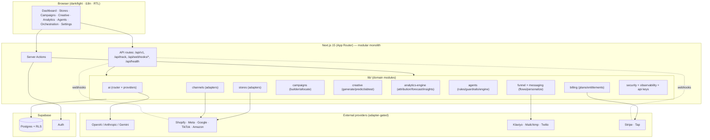

# Architecture

ForgeEC is a **modular monolith** (Next.js App Router) with clean seams for
future service extraction. One deployable app; feature logic lives in `lib/*`
behind adapter interfaces so external providers swap in without UI changes.

**Key principles:** every external dependency sits behind an adapter with a
working sandbox provider; the registry uses the live one only when credentials
are present. Multi-tenancy is enforced at the database via RLS (`my_org_ids()`).
Extraction path: heavy/async work (agent runs, syncs, attribution batch) can move
to a queue + worker; channels/AI can become services behind the same interfaces.
